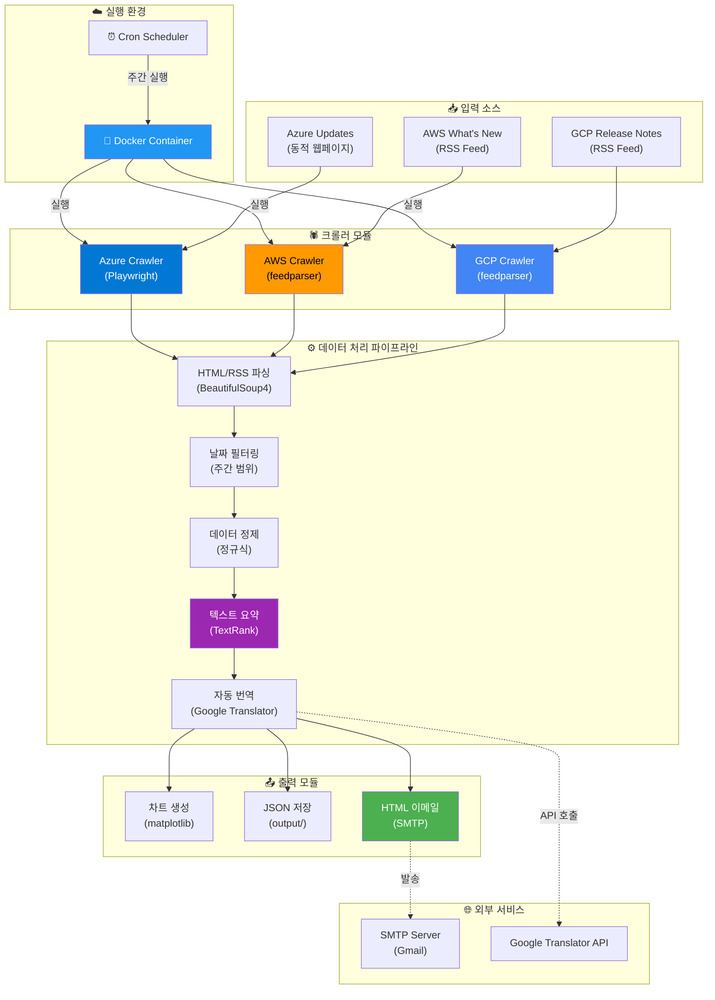
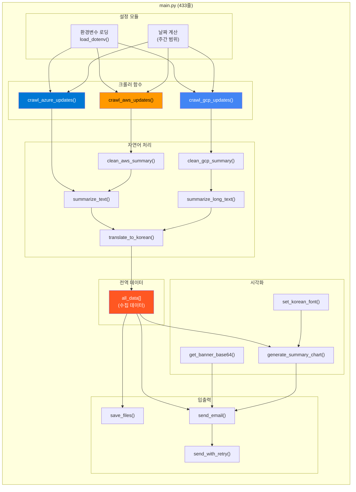
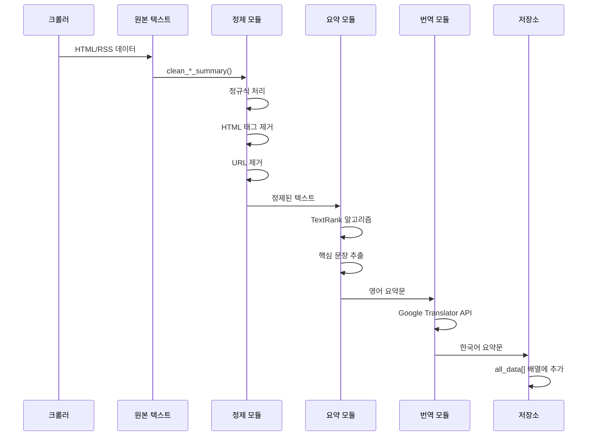
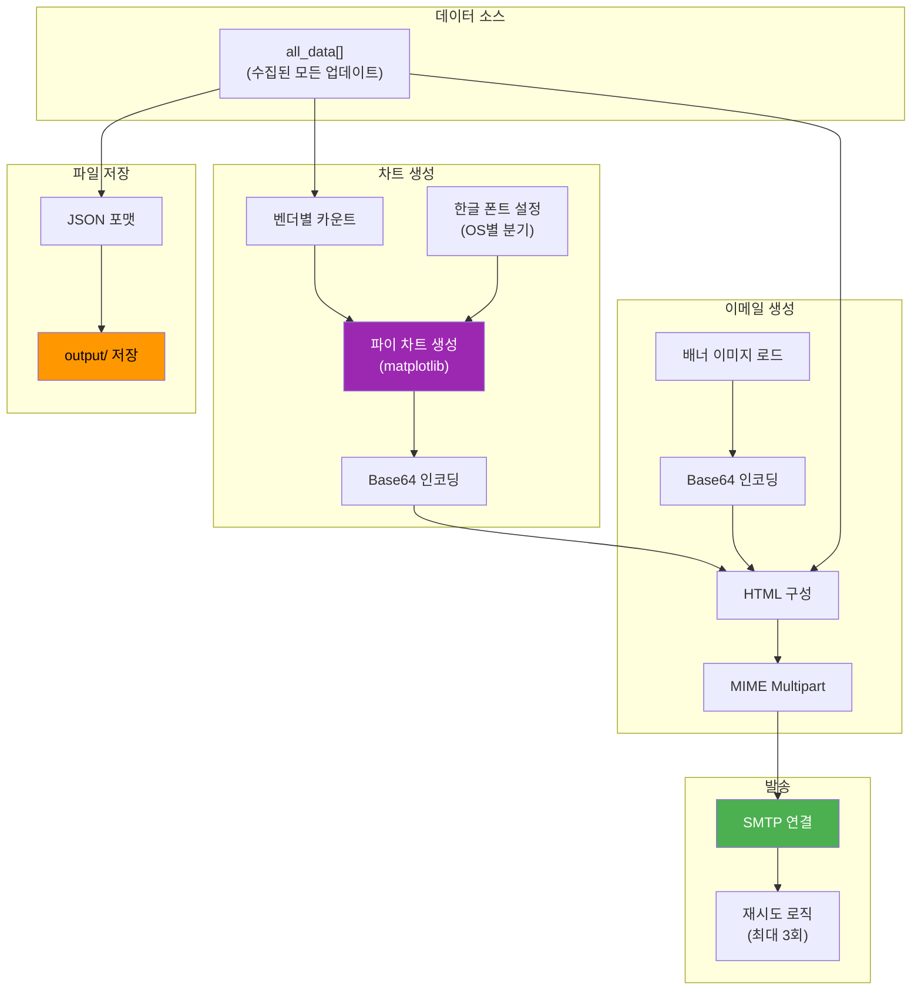
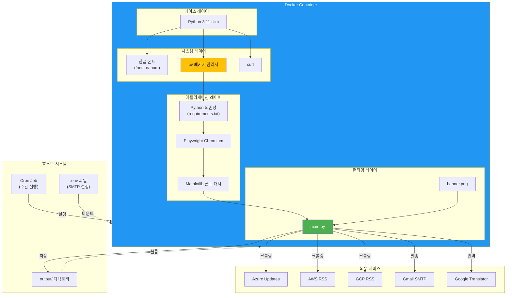
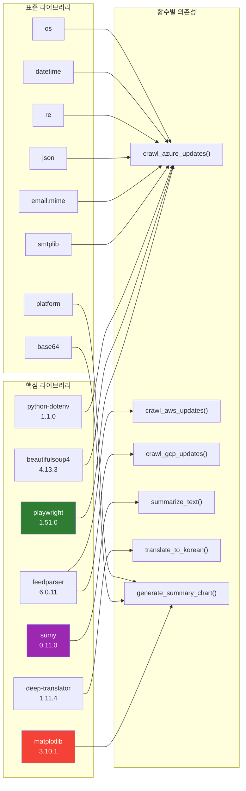
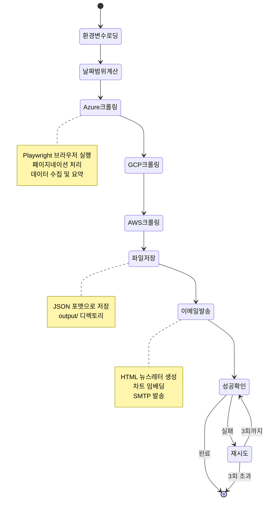

# CSP Scrapper 프로젝트 아키텍처

**작성일**: 2025-11-25  
**프로젝트**: csp-scrapper-uv  
**목적**: Cloud Service Provider 업데이트 자동 수집 및 뉴스레터 발송 시스템

---

## 📁 1. 프로젝트 파일 구조

```
csp-scrapper-uv/
├── .git/                          # Git 버전 관리
├── app/                           # 애플리케이션 소스 디렉토리
│   ├── main.py                    # 메인 실행 파일 (433줄)
│   ├── requirements.txt           # Python 의존성 정의
│   ├── banner.png                 # 이메일 배너 이미지 (738KB)
│   ├── .env.example               # 환경변수 템플릿
│   ├── .gitignore                 # Git 제외 파일 설정
│   └── output/                    # JSON 출력 디렉토리 (동적 생성)
├── Dockerfile                     # Docker 이미지 빌드 정의
├── README.md                      # 프로젝트 문서
└── docker-install.md              # Docker 설치 가이드
```

---

## 🏗️ 2. 시스템 아키텍처

### 2.1 전체 시스템 흐름도



### 2.2 코드 모듈 구조



---

## 🔧 3. 주요 컴포넌트 상세

### 3.1 크롤러 모듈

#### Azure Crawler
```python
기술 스택: Playwright + BeautifulSoup4
URL: https://azure.microsoft.com/en-us/updates
특징:
  - Chromium 브라우저 자동 제어 (headless)
  - 동적 JavaScript 렌더링 처리
  - 페이지네이션 자동 탐지 및 순회
  - CSS 선택자 기반 데이터 추출
처리 방식:
  1. 페이지 로딩 및 대기
  2. 전체 페이지 수 파악
  3. 각 페이지 순회하며 업데이트 항목 추출
  4. 날짜 필터링 (주간 범위만)
  5. 다음 페이지 클릭
```

#### AWS Crawler
```python
기술 스택: feedparser
URL: https://aws.amazon.com/new/feed/
특징:
  - RSS 2.0 피드 파싱
  - 실시간 업데이트 수집
  - published_parsed로 날짜 정보 추출
  - HTML 태그 제거 및 텍스트 정제
처리 방식:
  1. RSS 피드 파싱
  2. 각 항목의 날짜 확인
  3. 주간 범위 필터링
  4. HTML 정제 (URL, 불필요 문구 제거)
  5. 요약 및 번역
```

#### GCP Crawler
```python
기술 스택: feedparser + 정규식
URL: https://cloud.google.com/feeds/gcp-release-notes.xml
특징:
  - RSS XML 파싱
  - 서비스별 분류 (Feature, Announcement)
  - 정규식 패턴 매칭으로 항목 분할
  - 보안 업데이트 자동 제외
처리 방식:
  1. Release Notes RSS 파싱
  2. 정규식으로 서비스명 추출
  3. Feature/Announcement 분류
  4. 각 서비스별 콘텐츠 분리
  5. 긴 텍스트 청크 요약
```

### 3.2 데이터 처리 파이프라인



### 3.3 시각화 및 출력



---

## 🐳 4. Docker 컨테이너 아키텍처



---

## 📦 5. 의존성 맵



---

## 🔄 6. 데이터 흐름 상세

### 6.1 수집 단계

```
[Azure Web] --HTTP--> [Playwright] --HTML--> [BeautifulSoup4] --Extract--> [Raw Data]
[AWS RSS]   --HTTP--> [feedparser] --Parse--> [Entry Objects] --Extract--> [Raw Data]
[GCP RSS]   --HTTP--> [feedparser] --Parse--> [Entry Objects] --Regex--> [Raw Data]
```

### 6.2 처리 단계

```
[Raw Data] --> [clean_*_summary()] --> [Cleaned Text]
           --> [날짜 필터링] --> [주간 데이터만]
           --> [summarize_text()] --> [TextRank] --> [핵심 문장 2-3개]
           --> [translate_to_korean()] --> [Google API] --> [한국어 요약]
           --> [all_data[]] (전역 배열에 저장)
```

### 6.3 출력 단계

```
[all_data[]]
  ├─> [generate_summary_chart()] --> [PNG] --> [Base64] --> [Email HTML]
  ├─> [save_files()] --> [JSON] --> [output/cloud_updates_week_YYYY-MM-DD.json]
  └─> [send_email()]
        ├─> [HTML 구성] (배너 + 차트 + 업데이트 목록)
        ├─> [MIME Multipart]
        └─> [SMTP 발송] (재시도 3회)
```

---

## ⚙️ 7. 실행 플로우



---

## 🔐 8. 보안 및 설정

### 환경 변수 (.env)
```bash
SMTP_SERVER=smtp.gmail.com
SMTP_PORT=587
SENDER=youremail@gmail.com
EMAIL_PASSWORD=yourpassword
RECEIVERS=email1@example.com,email2@example.com
```

### Git 제외 파일 (.gitignore)
```
/app/output/
*.env
*.pyc
__pycache__/
*.log
```

---

## 📊 9. 아키텍처 특징 요약

| 계층 | 기술 | 목적 |
|------|------|------|
| **인프라** | Docker + Cron | 격리된 실행 환경, 자동 스케줄링 |
| **크롤링** | Playwright + feedparser | 동적/정적 페이지 수집 |
| **파싱** | BeautifulSoup4 + 정규식 | HTML/XML 데이터 추출 |
| **NLP** | TextRank + Google Translator | 요약 및 번역 |
| **시각화** | matplotlib | 차트 생성 |
| **통신** | SMTP + 재시도 로직 | 안정적 이메일 발송 |
| **저장** | JSON 파일 | 데이터 아카이빙 |

### 설계 원칙
✅ **모듈화**: 각 크롤러와 처리 함수가 독립적으로 동작  
✅ **확장성**: 새로운 클라우드 벤더 추가 용이  
✅ **안정성**: 재시도 로직 및 예외 처리 구현  
✅ **재현성**: Docker 컨테이너로 환경 일관성 보장  
✅ **자동화**: Cron 스케줄링으로 무인 운영  

---

**본 문서는 csp-scrapper-uv 프로젝트의 전체 아키텍처를 시각적으로 표현하고 각 컴포넌트의 역할과 상호작용을 설명합니다.**
